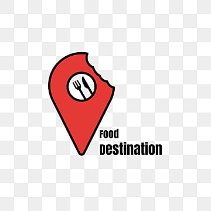

<p align="center">
  
</p>

<h1 align="center">🍽️ Meal-Map — Smart Restaurant Management System (SRMS)</h1>

<p align="center">
  Intelligent restaurant discovery, reservation, and management system powered by a Knowledge-Based Recommender System (KB-RS).
</p>

<p align="center">
  
  
  
  
  
  
</p>


---

# 🌟 Overview

**Meal-Map** is a full-stack smart restaurant management and discovery system that connects customers and restaurant owners through features like:

- Online table reservations  
- Smart restaurant recommendations  
- Owner dashboards  
- Menu & promotions management  
- Cloud-hosted MySQL database  
- Secure Python backend API  

It aims to automate restaurant operations and enhance customer experience with intelligence and seamless flow.

---

# 🎯 System Concept & Vision

## 🔍 What is Meal-Map?

Meal-Map is a smart restaurant platform featuring:

- User application  
- Owner dashboard  
- KB-RS recommendation engine  
- Aiven-hosted MySQL database  
- Python backend + HTML/CSS/JS frontend  

## 👁️ Vision

- Simplify restaurant discovery  
- Provide personalized suggestions  
- Enable effortless reservations  
- Boost owner management efficiency  
- Improve user experience with automation  

---

# 👥 System Users

### **1. Customer**
- Sign up with OTP  
- Explore restaurants  
- Get smart recommendations  
- Apply filters: cuisine, rating, budget, location  
- Make reservations  
- Leave reviews and mark favourites  
- Manage dashboard  

### **2. Restaurant Owner**
- Manage restaurant profile  
- Add or update menus  
- Launch promotions  
- Approve/cancel reservations  
- Track ratings & customer activity  

---

# 🏗️ Architecture
```
┌───────────────────────────────┐
│ Presentation Layer │
│ HTML • CSS • JavaScript │
└───────────────────────────────┘
┌───────────────────────────────┐
│ Application Layer │
│ Python Backend │
└───────────────────────────────┘
┌───────────────────────────────┐
│ RS Logic Layer │
│ Knowledge-Based Filtering Engine│
└───────────────────────────────┘
┌───────────────────────────────┐
│ Database Layer │
│ Aiven Cloud MySQL Database │
└───────────────────────────────┘
```
---

# ⚙️ Core Features

## ✨ Customer Features
- Account creation + OTP  
- Location-based exploration  
- Advanced filtering  
- Smart recommendations  
- Table reservation  
- Favourites & Reviews  
- Personalized dashboard  

## ✨ Owner Features
- Restaurant management  
- Menu CRUD operations  
- Promotions control  
- Reservation decisions  
- Customer engagement insights  

## 🔐 Security
- Password hashing  
- OTP verification  
- SQL injection prevention  
- API input validation  
- Session management  

---

# ☁️ Hosting & Deployment

| Component  | Technology |
|------------|------------|
| Frontend   | HTML / CSS / JS |
| Backend    | Python |
| Database   | Aiven Cloud-Hosted MySQL |
| Tools      | MySQL Workbench |

---

# 🗄️ Database Structure

The system uses **18 tables**:

- `address`  
- `cuisine`  
- `favorite`  
- `menu`  
- `menuitem`  
- `photo`  
- `promotion`  
- `rating`  
- `reservation`  
- `restaurant`  
- `restaurantcuisine`  
- `restaurantopeninghours`  
- `restauranttable`  
- `review`  
- `useraccount`  
- `useractivity`  
- `useraddress`  
- `usersession`  

These tables enable complete restaurant, user, and reservation workflows.

---

# 🧠 Recommender System (KB-RS)

## 📌 Type  
**Knowledge-Based Recommender System (KB-RS)**

## 📌 Why KB-RS?
- Works well with limited historical data  
- Uses explicit constraints  
- Ideal for new restaurants  

## 📌 Filtering Constraints
1. Cuisine Constraint  
2. Rating Constraint  
3. Budget Constraint  
4. Spatial Location Constraint  
5. Utility-Based Sorting  
6. Top-N Results Limit  

This ensures relevant, accurate restaurant recommendations.

---

# 📂 Backend Overview

### **Technology:** Python

### **Responsibilities**
- Authentication + OTP  
- Password hashing  
- KB-RS filtering engine  
- Reservations logic  
- CRUD operations  
- Favourite, review, promotions logic  

### **Entry File**
```
app.py
```
---

# 📈 UML Diagrams

The project includes complete UML documentation:

- Class Diagram  
- Use-Case Diagrams  
- Sequence Diagrams (User, Owner, Signup)  
- Activity Diagrams  
- Collaboration Diagram  
- Timing Diagram  
- Component Diagram  
- Deployment Diagram  

---

# 🚀 Installation & Setup

## 1️⃣ Clone Repository
```
git clone https://github.com/Syed-Waleed-Hussain/meal-map.git
cd meal-map
```

2️⃣ Install Python Dependencies
```
pip install -r requirements.txt
```
3️⃣ Setup Database
```
Import .sql schema
Update DB credentials in App.py
```
4️⃣ Run Backend
```
python server.py
python app.py
```
5️⃣ Run Frontend
```
Open index.html in a browser.
```
🔮 Future Enhancements
ML-based popularity ranking
Real-time order tracking
Advanced analytics dashboard
Chatbot for reservations

🤝 Contributors
Name	Roll Number
Syed Waleed Hussain
Sofia Ayaz	
Shayan Nemat	

📜 License
This project is licensed under the MIT License.

🙌 Acknowledgment
Thank you for exploring Meal-Map!
Enjoy the smart dining experience 🍽️💡

---

